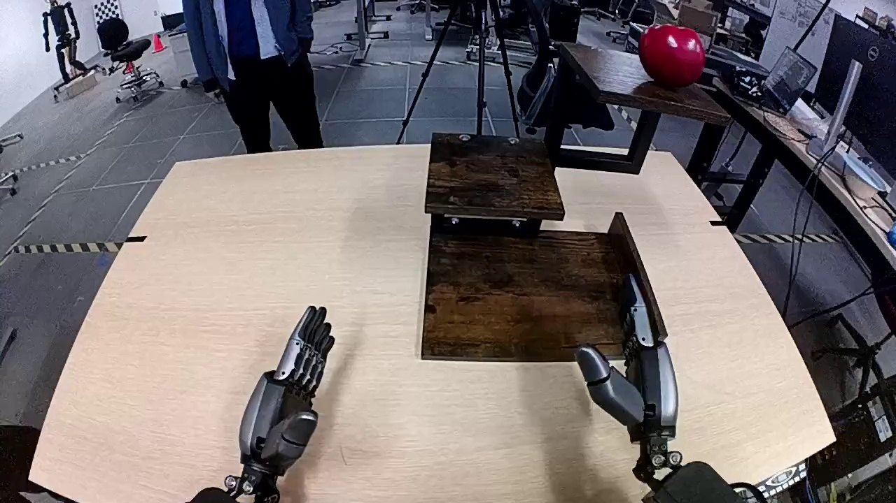

<!-- SPDX-FileCopyrightText: Copyright (c) 2026 NVIDIA CORPORATION & AFFILIATES. All rights reserved.
SPDX-License-Identifier: OpenMDW-1.1 -->

# Cosmos3-Reasoner Prompt Guide

## Inference Setup
### Sampling Parameters

Without reasoning:

```text
top_p=0.8
top_k=20
repetition_penalty=1.0
presence_penalty=1.5
temperature=0.7
```

With reasoning:

```text
top_p=0.95
top_k=20
repetition_penalty=1.0
presence_penalty=0.0
temperature=0.6
```

For video inputs, the notebook uses frame sampling through `extra_body`:

```python
extra_body={"mm_processor_kwargs": {"fps": 4, "do_sample_frames": True}}
```

### System Prompt

```text
You are a helpful assistant.
```

### Turn Reasoning On Or Off

Reasoning is controlled through the user prompt. If reasoning is required, append
the following instruction after the task text:

```text
Answer the question using the following format:

<think>
Your reasoning.
</think>

Write your final answer immediately after the </think> tag.
```

If reasoning is not required, omit the `<think>` instruction and ask directly for
the desired answer format.

### Media/Text Order

Always place media before the user text prompt in the payload. Use `image_url`
for images and `video_url` for videos.

```python
messages = [
    {"role": "system", "content": "You are a helpful assistant."},
    {
        "role": "user",
        "content": [
            {"type": "video_url", "video_url": {"url": "file:///path/to/video.mp4"}},
            {"type": "text", "text": "What's happening in this video?"},
        ],
    },
]
```

### 2D Grounding and Pointing Coordinate Conventions

2D boxes, points, and trajectories use normalized `0-1000` coordinates. The
origin is the top-left corner; `x` increases rightward and `y` increases
downward. Each axis is normalized independently, regardless of aspect ratio.

Bounding boxes use `[x1, y1, x2, y2]`:

```json
[
  {"bbox_2d": [x1, y1, x2, y2], "label": "object name"}
]
```

`x1, y1` are top-left; `x2, y2` are bottom-right.

Points and trajectories use `point_2d`:

```json
[
  {"point_2d": [x, y], "label": "target point"}
]
```

## Examples

The examples below mirror the notebook prompts. Media references point to the local assets used by `run_with_vllm.ipynb`. The following examples are tested with `Cosmos3-Super-Reasoner`

### Image Caption

Media:



User Prompt:

```text
Caption the image in detail.
```

Model Answer:

```text
This photograph, taken from a first-person perspective, appears to be captured by a camera mounted on a robot's head. The robot is positioned in front of a light-colored wooden desk, which features a rectangular brown tray in the center. The robot's two arms, equipped with hands, are visible, with the left hand's fingers slightly spread. In the background, there is a person wearing a blue suit jacket and black pants, standing with their back to the camera. The room has a gray floor and is filled with various items, including a red ball on a table to the right and a tripod to the left. Additionally, a black office chair and a computer desk are also visible in the background. The overall scene suggests a workspace or laboratory environment.
```

### Video Caption

Media:

[View video](assets/video_caption.mp4)

User Prompt:

```text
Describe the video in detail.
```

Model Answer:

````text
In this video, two robotic arms are positioned on either side of a white table. The table is set against a plain background, and the focus is on the interaction between the robots and the objects on the table. On the left side of the table, there is an open cardboard box filled with neatly stacked air column wraps, which are transparent plastic bags used for cushioning during shipping.

The robot on the right side of the table has a sleek design with metallic components and is equipped with a gripping mechanism at its end effector. This robot begins by moving its arm towards a small white box placed on the table near the edge. The robot's movements are precise and deliberate as it uses its gripper to pick up the white box.

Once the white box is securely grasped, the robot lifts it off the table and moves it towards the cardboard box containing the air column wraps. The robot then places the white box inside the cardboard box, ensuring it is positioned correctly among the air column wraps. Throughout this process, the robot's movements are smooth and controlled, demonstrating advanced coordination and precision.

The robot on the left side of the table remains stationary throughout the video, serving as a static reference point. Its presence suggests that it may be involved in subsequent actions or tasks, but it does not participate in the current activity.

Overall, the video showcases the capabilities of modern robotic technology in handling and organizing objects with accuracy and efficiency. The scene highlights the potential applications of such robots in logistics and packaging industries, where precision and speed are crucial.
````

### Temporal Localization

Media:

[View video](assets/temporal_localization_1.mp4)

User Prompt:

````text
List all action segments in the video.

Provide the result in json format with 'seconds' for time depiction for each event. Use keywords 'start', 'end' and 'caption' in the json output. Please list multiple events if applicable.

```json
[
{
  "start": t_start,
  "end": t_end,
  "caption": EVENT1
},
{
  "start": t_start,
  "end": t_end,
  "caption": EVENT2
},
...
]
```
````

Model Answer:

````text
```json
[
  {
    "start": 0.1,
    "end": 2.7,
    "caption": "A white and black humanoid robot stands beside a red popcorn dispenser, its right arm extended toward the machine while its left arm reaches for a green paper cup placed on a black table in front of it."
  },
  {
    "start": 2.7,
    "end": 4.2,
    "caption": "The robot's left arm grasps the green paper cup and lifts it slightly off the table, positioning it under the popcorn dispenser's spout."
  },
  {
    "start": 4.2,
    "end": 14.8,
    "caption": "The robot's right arm activates the dispenser, releasing a steady stream of popcorn into the cup held by its left arm, filling it gradually as the arm adjusts to maintain proper alignment."
  },
  {
    "start": 14.8,
    "end": 17.9,
    "caption": "Once the cup is sufficiently filled, the robot's left arm carefully places the cup back onto the black table, ensuring it remains stable."
  },
  {
    "start": 17.9,
    "end": 18.7,
    "caption": "The robot retracts both arms to a neutral position, completing the task with the popcorn cup now resting on the table."
  }
]
```
````

### Event Timeline

Media:

[View video](assets/temporal_localization_2.mp4)

User Prompt:

```text
Describe the notable events in the provided video. Provide the result in json format with 'mm:ss.ff' format for time depiction for each event. Use keywords 'start', 'end' and 'caption' in the json output.
```

Model Answer:

````text
```json
[
  {
    "start": "00:00.10",
    "end": "00:05.70",
    "caption": "A person in a green shirt stands at the far end of a long, empty hallway, arms crossed, observing the space. The hallway is brightly lit with white walls and a smooth gray floor, and a black tripod is visible on the right side."
  },
  {
    "start": "00:05.70",
    "end": "00:08.20",
    "caption": "The door on the left side of the hallway opens, revealing a room where two individuals are seen preparing to move items. One person, dressed in dark clothing, begins to step out carrying a cardboard box."
  },
  {
    "start": "00:08.20",
    "end": "00:11.70",
    "caption": "A man in a black outfit emerges from the room, carrying a brown cardboard box with blue tape. He walks down the hallway toward the person in the green shirt, passing by the tripod on the right."
  },
  {
    "start": "00:11.70",
    "end": "00:14.30",
    "caption": "Another man, also dressed in black, follows behind carrying a larger cardboard box with an Amazon logo. He walks steadily down the hallway, maintaining a steady pace as he approaches the person in green."
  },
  {
    "start": "00:14.30",
    "end": "00:22.90",
    "caption": "A third man, wearing a white sweater and black pants, exits the room carrying a smaller cardboard box. He walks down the hallway, passing the others, and continues toward the person in green, who remains standing at the far end."
  },
  {
    "start": "00:22.90",
    "end": "00:24.90",
    "caption": "All three men have now reached the person in the green shirt, who remains stationary at the end of the hallway. The hallway is momentarily quiet as they gather near the end, with the tripod still visible on the right."
  }
]
```
````

### Timestamp Query

Media:

[View video](assets/temporal_localization_2.mp4)

User Prompt:

```text
When is "A man in a white sweater walks out of a room carrying a box, closes the door behind him, walks on the floor, and turns left at the end near the wall." depicted in the video? Please provide the result in json format with 'mm:ss.ff' format for time depiction for the event. Use keywords 'start', 'end' in the json output.
```

Model Answer:

````text
```json
{
  "start": "00:13.30",
  "end": "00:23.40"
}
```
````

### Interval Question

Media:

[View video](assets/temporal_localization_2.mp4)

User Prompt:

```text
What happened between 00:05.64 and 00:17.49?
```

Model Answer:

```text
The door on the left opens, and three individuals sequentially emerge, each carrying a cardboard box, and proceed down the hallway.
```

### Embodied Reasoning

#### Robotics Next Action

Media:

[View video](assets/robotics_next_action.mp4)

User Prompt:

```text
What can be the next immediate action?

Answer the question using the following format:
<think>
Your reasoning.
</think>
Write your final answer immediately after the </think> tag.
```

Model Answer:

```text
<think>
Okay, let's see. The video is a lab or workshop with two robot arms. The camera is top-down, showing a cardboard box in the center, air column wrap to the right, and some items arranged next to it. Robot Arm 1 is on the left, stationary. Robot Arm 2 on the right just picked up a smart charger from the items and is moving it upwards and slightly left.

So, what's next? The smart charger is being lifted. The box is open and has air column wrap inside. Maybe the next step is placing the charger into the box. Since the box is in the center and the arm is moving left, which is towards the box. The air column wrap is there for cushioning, so placing the charger into the box makes sense. Also, the items were arranged in sequence, so after picking up one, the next action would logically be placing it into the box. Robot Arm 1 hasn't moved yet, so maybe Arm 2 continues the task. So the immediate next action should be placing the smart charger into the cardboard box.
</think>

The robot arm places the smart charger into the cardboard box, positioning it securely within the air column wrap for cushioning.
```

#### Drive Scene Next Action

Media:

[View video](assets/drive_scene_next_action.mp4)

User Prompt:

```text
You are an autonomous vehicle planning system. The video depicts the observation from the vehicle's camera. You need to observe the critical objects in the environment and reason your next action and the driving trajectory ahead.
```

Model Answer:

```text
I am driving straight on a three-lane road, maintaining a safe distance from the car ahead of me. As I approach the intersection, the traffic light is green, and I continue moving forward. I notice a black car turning right from the adjacent lane, so I proceed cautiously while monitoring its movement. I also see a pedestrian crossing sign and a few pedestrians walking on the sidewalk, so I remain alert for any sudden movements.
```

#### Robot Planning

Media:


User Prompt:

```text
The task is to put flower into the red bottle. Generate a plan consisting of subtasks for accomplish the task.
```

Model Answer:

```text
1. Move the arm to the red bottle.
2. Pick up the red bottle.
3. Place the red bottle on the table.
4. Pick up the flower.
5. Move the arm to the red bottle.
6. Drop the flower into the red bottle.
```

#### Assisted Task Next Action

Media:

[View video](assets/assisted_task_next_action.mp4)

User Prompt:

```text
This is the overall task that the agent is trying to complete: "The student exchanges the black ink cartridge of the printer."
In the video, the agent is trying to follow the instruction (a single step out of many to complete the overall task): "place old ink_cartridge."
What should be the next action of the agent?
Answer the question using the following format:
<think>
Your reasoning.
</think>
Write your final answer immediately after the </think> tag.
```

Model Answer:

````text
<think>
Okay, let's break this down. The user is trying to replace the black ink cartridge in the printer. The current instruction they're following is "place old ink_cartridge," which seems a bit off because usually, you remove the old one first before placing a new one.

Looking at the video, the hand was holding the old black ink cartridge and placed it on the printer's top. But the next logical step after removing the old cartridge would be to take out the new one from the holder. The printer has a holder with multiple cartridges (cyan, magenta, yellow, black), so the agent probably needs to pick the new black one next. Since the instruction was to place the old one, maybe they successfully did that, but the next action should be inserting the new cartridge. However, the user's instruction might be incorrect, so the agent might need to correct by taking the new cartridge. The correct next action should be to grab the new black ink cartridge from the holder.
</think>
grab new ink_cartridge
````

### Common Sense Reasoning

Media:

[View video](assets/common_sense_reasoning.mp4)

User Prompt:

```text
Can the countertop support the weight of the juicers?
Answer the question using the following format:

<think>
Your reasoning.
</think>

Write your final answer immediately after the </think> tag.
```

Model Answer:

````text
<think>
Okay, let's try to figure out if the countertop can support the weight of the juicers. The video shows the scene where there are two juicers on the countertop. The first one is on the left, blue and silver with a Union Jack design. The second is on the right, also blue with the same design. The countertop is wooden.

First, I need to consider the typical weight of juicers. Juicers can vary in weight depending on their size and material. A standard countertop juicer might weigh between 5 to 15 pounds. Since there are two of them, that's a combined weight of 10 to 30 pounds. Wooden countertops are generally sturdy, especially if they're part of a kitchen setup. They're designed to hold various kitchen appliances and ingredients.

The video shows other items on the countertop: a glass with juice, a chopping board, fruits like pineapples, lemons, and bananas. These items add some weight, but the main concern is the juicers. The countertop is wooden, which is a strong material. Unless the juicers are extremely heavy or the countertop is old and damaged, it should hold them without issues. The video doesn't show any signs of stress or bending in the countertop, so it's likely supporting the weight fine. Also, the man is interacting with the juicers without any problems, which suggests the countertop is stable. So, probably yes, the countertop can support the weight.
</think>

The countertop appears capable of supporting the weight of the juicers. Here's the reasoning:

1. **Material and Design**: The countertop in the video is wooden, a sturdy material commonly used in kitchens to handle heavy appliances and ingredients. Wooden countertops are typically engineered to withstand the weight of standard kitchen tools and appliances.

2. **Juicer Weight**: While juicers vary in weight, most countertop models range from 5-15 pounds each. Even with two juicers (10-30 pounds combined), this is well within the load-bearing capacity of a typical kitchen countertop, especially when distributed across a flat surface.

3. **Contextual Clues**: The scene shows no signs of strain (e.g., bending, cracking, or instability in the countertop). The man interacts with the juicers and other items (e.g., lifting a glass, gesturing) without hesitation, implying the setup is stable.

4. **Additional Items**: The presence of other items (fruits, chopping board, glass) further suggests the countertop is designed to handle routine kitchen tasks, reinforcing its structural adequacy.

**Conclusion**: Yes, the wooden countertop is likely sturdy enough to support the weight of the juicers and other items shown. No evidence in the scene indicates otherwise.
````

### 2D Grounding

Media:


User Prompt:

```text
Locate the accurate bounding box of the load as a whole. Return a json.
```

Expected answer shape:

```json
[
  {"bbox_2d": [x1, y1, x2, y2], "label": "load"}
]
```

Visualization note:
Coordinates are normalized to 0-1000 per axis. Convert them back to pixels with
`x / 1000 * width` and `y / 1000 * height` before drawing.

Model Answer:

````text
```json
[
    {"bbox_2d": [214, 141, 497, 722], "label": "load as a whole"}
]
```
````

### Describe Anything

Media:


User Prompt:

```text
Please caption the notable attributes in the provided image. List and describe all marked subjects in the image with their categories and detailed captions using a json with keyword "subject_id", "category" and "caption".
```

Expected answer shape:

```json
[
  {
    "subject_id": "2",
    "category": "object category",
    "caption": "Detailed visual caption for the marked subject."
  }
]
```

Model Answer:

````text
```json
[
  {"subject_id": "2", "category": "ski", "caption": "The ski is white with a striking black and red graphic design that includes a stylized bird motif; it features a black binding system with red highlights and a black toe piece."},
  {"subject_id": "4", "category": "ski parka", "caption": "This turquoise ski parka is equipped with a high collar, a front zipper, and long sleeves ending in elastic cuffs; it also has a chest pocket with a zipper and a small white logo on the left sleeve, along with a hem that likely has an elastic drawstring for a snug fit."},
  {"subject_id": "5", "category": "ski parka", "caption": "The black ski parka is designed with a high collar, a front zipper, and long sleeves; it includes a white logo on the left chest and a white stripe running down the right sleeve, with elastic cuffs and a hem that appears to have an adjustable drawstring."}
]
```
````

### Action CoT

Note about trajectory coordinates:
The model uses normalized point coordinates on images and videos. The origin is
the top-left corner. X increases to the right, and Y increases downward. Each
axis is independently normalized to 0-1000, regardless of aspect ratio.

#### Trajectory Coordinates

Media:


User Prompt:

```text
You are given the task "Move the pink bowl to the right". Specify the 2D trajectory your end effector should follow in pixel space. Return the trajectory coordinates in JSON format like this: {"point_2d": [x, y], "label": "gripper trajectory"}.
Answer the question using the following format:

<think>
Your reasoning.
</think>

Write your final answer immediately after the </think> tag.
```

Expected final answer shape after `</think>`:

```json
[
  {"point_2d": [721, 674], "label": "gripper trajectory"},
  {"point_2d": [549, 745], "label": "gripper trajectory"}
]
```

Model Answer:

````text
<think>
I will move my gripper to [713, 680] to approach the pink bowl at [520, 790] from a safe distance. Then I will lower the gripper to grasp the bowl, making sure I have a secure hold without disturbing the wooden spoon at [444, 846] or the metal pot at [437, 710]. Once the bowl is firmly gripped, I will lift it and carry it to the open space on the right at [573, 807], which is clear of other objects. I will carefully place the pink bowl down on the clear surface of the stovetop at [560, 812], ensuring it is stable and does not obstruct the gas stove at [607, 813] or the white refrigerator at [254, 453]. After confirming the bowl is securely positioned, I will retract my gripper to complete the task.

So my next steps should look like this: [713, 680], [552, 721], [517, 755], [592, 739], [588, 680]
</think>

```json
[
  {"point_2d": [713, 680], "label": "gripper trajectory"},
  {"point_2d": [552, 721], "label": "gripper trajectory"},
  {"point_2d": [517, 755], "label": "gripper trajectory"},
  {"point_2d": [592, 739], "label": "gripper trajectory"},
  {"point_2d": [588, 680], "label": "gripper trajectory"}
]
```
````

Second trajectory example:

Media:


User Prompt:

```text
You are given the task "Put flower into the red bottle". Specify the 2D trajectory your end effector should follow in pixel space. Return the trajectory coordinates in JSON format like this: {"point_2d": [x, y], "label": "gripper trajectory"}.
Answer the question using the following format:

<think> Your reasoning. </think>
Write your final answer immediately after the </think> tag.
```

Model Answer:

````text
<think>
I will move my gripper from its current position at [490, 419] to the red flower at [390, 702] to grasp it. After securing the flower, I will lift it and travel to the open space between the flower and the red bottle at [488, 667] to reposition it. Then I will proceed to the red bottle at [717, 604] and carefully place the flower inside, completing the instruction.

So my next steps should look like this: [490, 419], [411, 568], [529, 305], [749, 443], [729, 419]
</think>

```json
[
  {"point_2d": [490, 419], "label": "gripper trajectory"},
  {"point_2d": [411, 568], "label": "gripper trajectory"},
  {"point_2d": [529, 305], "label": "gripper trajectory"},
  {"point_2d": [749, 443], "label": "gripper trajectory"},
  {"point_2d": [729, 419], "label": "gripper trajectory"}
]
```
````

#### Driving Scene

Media:

[View video](assets/action_cot_driving_scene.mp4)

User Prompt:

```text
The video depicts the observation from the vehicle's camera. You need to think step by step and identify the objects in the scene that are critical for safe navigation.
Answer the question using the following format:
<think>
Your reasoning.
</think>
Write your final answer immediately after the </think> tag.
```

Model Answer:

````text
<think>
I yield to the pedestrian crossing the road, which is critical.
</think>
Pedestrians & Personal Mobility - Adults walking
````

### Physical Plausibility Analysis

Media:

[View video](assets/physical_plausibility.mp4)

User Prompt:

```text
Is this video physically plausible/possible according to your understanding of e.g. object permanence, shape constancy (objects maintain shape over time), continuous trajectories of objects? Assume it is the normal laws of physics.
Your answer should be based on the events in the video and ignore the quality of the simulation engine. The rising wall is part of the experiment setup and should not be judged for plausibility.
(A) Possible
(B) Impossible
```

Model Answer:

```text
A
```

### Situation Understanding

Media:

[View video](assets/situation_understanding.mp4)

User Prompt:

```text
What is the person doing with the skillet? What will the person likely do next in this situation?
```

Model Answer:

```text
The person is tilting the skillet to evenly spread the oil across its surface, ensuring it coats the entire cooking area. Next, they will likely pour the egg mixture into the skillet to begin cooking the omelet.
```
